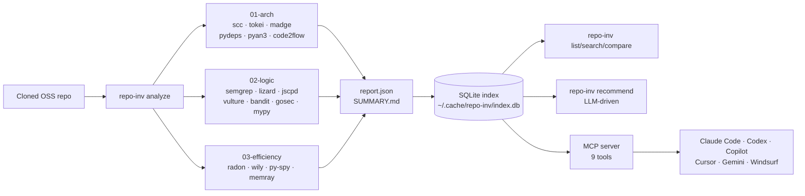

<div align="center">

# 🔬 Code Analysis Suite

**The agent-facing toolkit for dissecting open-source repositories.**

*One command — `repo-inv analyze <path>` — drives 29 best-in-class static analyzers,
indexes the result into a cross-repo knowledge base, and lets your AI coding agent
"mix-and-match copy" architecture from the best of OSS.*

[](#installation)
[](#mcp-integration)
[](docs/MCP.md)
[](docs/USAGE.md#wrapped-tools)
[](LICENSE)

[Quick Start](#-quick-start) ·
[How it works](#-how-it-works) ·
[Architecture](docs/ARCHITECTURE.md) ·
[MCP setup](docs/MCP.md) ·
[中文文档](docs/zh/README.md)

</div>

---

## ✨ Why this exists

Modern AI coding agents are great at writing code, but **bad at reading large unfamiliar
codebases**. When you clone an OSS repo and ask Claude / Codex / Copilot to "understand
this and borrow the good parts", the agent typically falls into one of two failure modes:

1. **Greps blindly** — burns context tokens reading random files.
2. **Hallucinates structure** — invents class hierarchies that don't exist.

`code_analysis_suite` fixes both: it gives every agent a single, deterministic, tool-driven
investigation pipeline, plus a persistent SQLite index of everything it has ever seen — so
the next question gets a richer answer, not a fresh blind grep.

## 🚀 Quick Start

```bash
# 1. One-time install
git clone https://github.com/<you>/code_analysis_suite
cd code_analysis_suite && npm install && sudo npm link

# 2. (Optional) register the MCP server with your agent
repo-inv install-mcp claude-code     # or: copilot / cursor / codex / gemini / windsurf

# 3. Analyze any repository
repo-inv analyze /path/to/some-cloned-oss-repo --parallel

# 4. Cross-repo brain (after you've analyzed a few)
repo-inv list --by quality
repo-inv search "retry OR backoff"
repo-inv compare repo-fastapi repo-litestar
repo-inv recommend "I need a plugin system with hot-reload"
```

Output lands in `~/.cache/repo-inv/<repo>-<ts>/` and the cross-repo index is at
`~/.cache/repo-inv/index.db` (SQLite + FTS5). The target repo is **never modified**.

## 🧠 How it works



Three layers, one report:

| Layer | Question it answers | Key tools |
|---|---|---|
| **🏗️ Architecture** | *What modules exist, how do they depend on each other?* | scc, tokei, pydeps, madge, dependency-cruiser, code2flow, pyan3 |
| **🧠 Business logic** | *Where is the complexity, the duplication, the security risk?* | semgrep, lizard, jscpd, vulture, bandit, gosec, pyright, mypy |
| **⚡ Efficiency** | *How does complexity evolve, where's the hot path?* | radon, wily, py-spy, memray |

See [docs/ARCHITECTURE.md](docs/ARCHITECTURE.md) for the full pipeline diagram and the
[knowledge-base schema](docs/ARCHITECTURE.md#knowledge-base-schema).

## 📦 Installation

**Prerequisites:** Node ≥18, Python ≥3.10. Optional analyzers (Go, Rust, Java) are
auto-skipped if missing — `repo-inv tools` shows what's available on your machine.

```bash
git clone https://github.com/<you>/code_analysis_suite
cd code_analysis_suite
npm install
sudo npm link             # exposes `repo-inv` and `repo-inv-mcp` globally
pip install -r requirements.txt   # optional Python analyzers
repo-inv tools                    # see what's installed
```

For LLM-powered subcommands (`learn`, `recommend`), add a `.env` in the suite root:

```bash
DEEPSEEK_API_KEY=sk-...
# OPENAI_API_KEY=sk-...        # (planned)
# ANTHROPIC_API_KEY=sk-ant-... # (planned)
```

## 🔌 MCP integration

`repo-inv install-mcp <host>` registers an idempotent stdio MCP server with any of:

| Host | Config touched |
|---|---|
| `copilot` | `~/.copilot/mcp-config.json` |
| `cursor` | `~/.cursor/mcp.json` |
| `gemini` | `~/.gemini/settings.json` |
| `codex` | `~/.codex/config.toml` |
| `windsurf` | `~/.codeium/windsurf/mcp_config.json` |
| `claude-desktop` | `~/.config/claude/claude_desktop_config.json` |
| `claude-code` | wraps `claude mcp add` |
| `hermes` | prints a generic stdio template |

Each write is backed up to `<file>.bak`. Use `--dry-run` to preview, `--all` for
every host whose config already exists. Full details: [docs/MCP.md](docs/MCP.md).

The server exposes **9 tools**: `list_repos`, `search_knowledge`, `compare_repos`,
`get_repo_details`, `patterns_of_repo`, `repos_with_pattern`, `extract_code`,
`analyze_repo`, `recommend`.

## 🗺️ Documentation

- **[Architecture](docs/ARCHITECTURE.md)** — pipeline, data flow, SQLite schema
- **[Usage examples](docs/USAGE.md)** — end-to-end walkthroughs of all 12 subcommands
- **[MCP integration](docs/MCP.md)** — per-agent setup, tool reference
- **[Agent contract](AGENTS.md)** — vendor-neutral conventions agents should follow
- **[Contributing](CONTRIBUTING.md)** — add a new analyzer, add a new pattern rule
- **[中文文档](docs/zh/README.md)** — original Chinese README

## 🎯 Example output

```bash
$ repo-inv analyze ~/projects/fastapi --parallel
🚀 Running 3 layers in parallel...
  → 01-arch    scc · tokei · madge · pydeps   ✓ (12s)
  → 02-logic   semgrep · lizard · jscpd · vulture · bandit · mypy   ✓ (54s)
  → 03-efficiency  radon · wily   ✓ (8s)
📝 Summary: ~/.cache/repo-inv/fastapi-20260524-1830/SUMMARY.md
📊 Machine report: ~/.cache/repo-inv/fastapi-20260524-1830/report.json
   Indexed as #7 in ~/.cache/repo-inv/index.db

$ repo-inv recommend "add a retry+ratelimit HTTP layer to my agent"
🤖 DeepSeek recommends:
  1. Primary: tenacity (already indexed) — pure Python retry, exponential backoff
  2. Pattern to borrow: fastapi/Middleware (file: fastapi/middleware/cors.py)
  3. Avoid hotspot: requests_cache/backends/sqlite.py (CCN 67, fragile)
  4. Action: repo-inv extract ~/projects/tenacity tenacity/_utils.py --out ./vendor
```

## 🤝 Contributing

PRs welcome — see [CONTRIBUTING.md](CONTRIBUTING.md). Particularly looking for:

- New analyzer integrations (one entry in `lib/tools.js` + a runner section)
- New semgrep pattern rules in `rules/patterns.yml`
- LLM provider abstraction (currently DeepSeek-only for `learn`/`recommend`)
- More MCP host adapters in `install-mcp`

## 📜 License

[MIT](LICENSE) — © 2026 code_analysis_suite contributors
