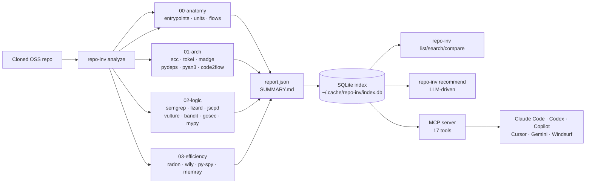

<div align="center">

# 🔬 Code Analysis Suite

**The agent-facing toolkit for learning from excellent source code and reviewing your own projects.**

*One command — `repo-inv analyze <path>` — drives 29 best-in-class static analyzers,
indexes the result into a cross-repo knowledge base, then helps your AI coding agent
map the main trunk first: deployable units, entrypoints, exposed interfaces, business-flow skeletons, borrowable assets, and then test your own project against that trunk.*

[](https://github.com/CHINGBOH/code-analysis-suite/actions/workflows/ci.yml)
[](#installation)
[](#mcp-integration)
[](docs/MCP.md)
[](docs/USAGE.md#wrapped-tools)
[](LICENSE)

[Quick Start](#-quick-start) ·
[How it works](#-how-it-works) ·
[Architecture](docs/ARCHITECTURE.md) ·
[MCP setup](docs/MCP.md) ·
[中文文档](docs/zh/README.md)

</div>

---

## ✨ Why this exists

**This repo is a toolbox. You — the AI — call its tools instead of reading
source code by hand.**

The human writes code with AI exclusively. What they need is not for the AI
to grep, skim, and guess — but for the AI to **invoke real analyzers**
that test for architecture / function / boundary / ops / parse-efficiency /
runtime-efficiency problems, then cite the structured output. Calling the
right tool *is* the deliverable. No code-reading, no opinion-forming, no
debug-by-vibe.

There are two AIs reading this section:

1. **An AI inside this repo** — invoked while the user is `cd`'d into
   `code_analysis_suite/`. Your job is to know what `repo-inv` exposes and
   call it.
2. **An AI using this repo to dissect *some other* source code** — the user
   pointed you at an unfamiliar codebase. Your job is **not** to read it
   file-by-file; it is to call `repo-inv` against it and quote what comes
   back.

Either way the rule is the same: **pick the problem dimension → call the
tool → cite the output → task done.**

### Tool lookup by problem dimension

| When the user asks about… | Call (CLI / MCP) | What lands on disk / in the response |
|---|---|---|
| **Architecture** — entrypoints, deployable units, modules, dep graph | `repo-inv dissect <repo>`  ·  `repo-inv analyze <repo> -l anatomy,arch`  ·  MCP `dissect_repo` / `get_entrypoints` / `get_deployable_units` | `00-anatomy/ANATOMY.md` · `01-arch/{scc.json,tokei.json,pydeps.svg,madge-circular.txt,depcruise.json,pyan3-callgraph.dot}` |
| **Function quality** — complexity, duplication, anti-patterns, dead code | `repo-inv analyze <repo> -l logic`  ·  MCP `analyze_repo` | `02-logic/{lizard.txt,lizard.xml,semgrep.json,jscpd/,ast-grep.json,vulture.txt,bandit.json,mypy.txt,pyright.txt}` |
| **Module / boundary** — circular imports, layer violations, idioms | `repo-inv patterns <repo>`  ·  `analyze -l arch`  ·  MCP `patterns_of_repo` / `repos_with_pattern` | `madge-circular.txt` · `depcruise.json` · semgrep pattern hits + DB-persisted pattern catalog |
| **Ops surface** — deployable shape, CI presence, runtime kind | `repo-inv dissect <repo>` (anatomy detects Dockerfile / compose / `package.json bin` / `pyproject.toml [scripts]` / k8s yaml / `.github/workflows/`) | `ANATOMY.md → deployable_units[]` + risk `deployment_gap` if manifests missing |
| **Parse / size** — language mix, LOC, file count | `repo-inv analyze -l arch` (scc + tokei) | `01-arch/scc.json` · `tokei.json` |
| **Runtime efficiency** — complexity hotspots, evolution, memory, profiling | `repo-inv analyze -l efficiency` (radon · wily · py-spy · memray — last two need a runnable scenario) | `03-efficiency/{radon-cc.txt,radon-mi.txt,wily.txt,py-spy.svg,memray.bin,memray.html}` |
| **Cross-repo precedent** — "has anyone already solved this?" | `repo-inv search "<query>"`  ·  `borrow "<topic>"`  ·  `compare <a> <b>`  ·  `recommend "<task>"`  ·  MCP `search_knowledge` / `borrow_guide` / `compare_repos` / `recommend` | FTS5 hits from `LEARNINGS.md` + `SUMMARY.md` · ranked borrow targets · side-by-side metric diff · DeepSeek pick |
| **Synthesise "what to learn"** | `repo-inv learn [outdir]` (DeepSeek) | `LEARNINGS.md` — explicit *why*-annotations next to the metrics |
| **Pull a piece of code out** | `repo-inv extract <repo> <file> --out <dir>`  ·  MCP `extract_code` | transplantable slice = target file + its 1-hop intra-repo imports |
| **Reverse-instrument the user's own project** | `repo-inv review <repo>`  ·  `audit <repo> --against <excellent-repo>`  ·  MCP `project_review` / `audit_project` | architecture/skeleton/business/copy-risk markdown report |

### Operating rules

- **Do not read source files yourself when a tool covers the question.** The
  catalogue above is exhaustive across the four layers; if the question
  doesn't fit any row, that's the only time grep/Read is appropriate.
- **Cite tool output by file path.** When you answer the user, point at
  `~/.cache/repo-inv/<repo>-<ts>/<layer>/<file>` — not at your interpretation
  of it.
- **Tool absence is not failure.** `repo-inv tools` lists which analyzers are
  installed locally; missing ones are silently skipped. Run what you have.
- **MCP is the preferred surface.** `repo-inv install-mcp <host>` wires
  `bin/repo-inv-mcp.mjs` into Claude Code / Cursor / Codex / Gemini /
  Windsurf / Copilot — after that, every row above is one MCP call away.

**Task completion criterion: the relevant tool was called and its output was
quoted. Not "the AI formed an architectural opinion".**

## 🚀 Quick Start

```bash
# 1. One-time install
git clone https://github.com/<you>/code_analysis_suite
cd code_analysis_suite && npm install && sudo npm link

# 2. (Optional) register the MCP server with your agent
repo-inv install-mcp claude-code     # or: copilot / cursor / codex / gemini / windsurf

# 3. Analyze any repository
repo-inv standard --profile rag_agent
repo-inv dissect /path/to/some-cloned-oss-repo --profile rag_agent
repo-inv analyze /path/to/some-cloned-oss-repo --parallel

# 4. Cross-repo brain (after you've analyzed a few)
repo-inv list --by quality
repo-inv search "retry OR backoff"
repo-inv borrow "plugin system with hot reload"
repo-inv audit my-project --against repo-fastapi --profile rag_agent
repo-inv compare repo-fastapi repo-litestar
repo-inv recommend "I need a plugin system with hot-reload"
```

Output lands in `~/.cache/repo-inv/<repo>-<ts>/` and the cross-repo index is at
`~/.cache/repo-inv/index.db` (SQLite + FTS5). The target repo is **never modified**.

## 🧠 How it works



Entrypoint-first anatomy plus three evidence layers, one report:

| Layer | Question it answers | Key tools |
|---|---|---|
| **🧭 Anatomy** | *What are the deployable units, entrypoints, interfaces, and main business trunks?* | built-in repo walk, manifests, route heuristics |
| **🏗️ Architecture** | *What modules exist, how do they depend on each other?* | scc, tokei, pydeps, madge, dependency-cruiser, code2flow, pyan3 |
| **🧠 Business logic** | *Where is the complexity, the duplication, the security risk?* | semgrep (+ curated wtfpython gotcha rules), lizard, jscpd, vulture, bandit, gosec, pyright, mypy |
| **⚡ Efficiency** | *How does complexity evolve, where's the hot path?* | radon, wily, py-spy, memray |

See [docs/ARCHITECTURE.md](docs/ARCHITECTURE.md) for the full pipeline diagram and the
[knowledge-base schema](docs/ARCHITECTURE.md#knowledge-base-schema).

## 📦 Installation

**Prerequisites:** Node ≥18, Python ≥3.10. Optional analyzers (Go, Rust, Java) are
auto-skipped if missing — `repo-inv tools` shows what's available on your machine.

```bash
git clone https://github.com/<you>/code_analysis_suite
cd code_analysis_suite
npm install
sudo npm link             # exposes `repo-inv` and `repo-inv-mcp` globally
pip install -r requirements.txt   # optional Python analyzers
repo-inv tools                    # see what's installed
```

For LLM-powered subcommands (`learn`, `recommend`), add a `.env` in the suite root:

```bash
DEEPSEEK_API_KEY=sk-...
# OPENAI_API_KEY=sk-...        # (planned)
# ANTHROPIC_API_KEY=sk-ant-... # (planned)
```

## 🔌 MCP integration

`repo-inv install-mcp <host>` registers an idempotent stdio MCP server with any of:

| Host | Config touched |
|---|---|
| `copilot` | `~/.copilot/mcp-config.json` |
| `cursor` | `~/.cursor/mcp.json` |
| `gemini` | `~/.gemini/settings.json` |
| `codex` | `~/.codex/config.toml` |
| `windsurf` | `~/.codeium/windsurf/mcp_config.json` |
| `claude-desktop` | `~/.config/claude/claude_desktop_config.json` |
| `claude-code` | wraps `claude mcp add` |
| `hermes` | prints a generic stdio template |

Each write is backed up to `<file>.bak`. Use `--dry-run` to preview, `--all` for
every host whose config already exists. Full details: [docs/MCP.md](docs/MCP.md).

The server exposes **17 tools**: `list_repos`, `search_knowledge`, `compare_repos`,
`get_repo_details`, `patterns_of_repo`, `repos_with_pattern`, `extract_code`,
`analyze_repo`, `recommend`, `get_standard_architecture`, plus architecture-learning tools `borrow_guide` and
`project_review`, `dissect_repo`, `get_entrypoints`, `get_deployable_units`, `get_business_flows`, and `audit_project`.

## 🗺️ Documentation

- **[AI Development Standard](docs/AI_DEV_STANDARD.md)** — the tool-call-first yardstick; apply against any repo (yours or someone else's) to get an architecture / function / ops / discipline / profile-fit verdict
- **[Architecture](docs/ARCHITECTURE.md)** — pipeline, data flow, SQLite schema
- **[Usage examples](docs/USAGE.md)** — end-to-end walkthroughs of all 12 subcommands
- **[MCP integration](docs/MCP.md)** — per-agent setup, tool reference
- **[Agent contract](AGENTS.md)** — vendor-neutral conventions agents should follow
- **[Contributing](CONTRIBUTING.md)** — add a new analyzer, add a new pattern rule
- **[中文文档](docs/zh/README.md)** — original Chinese README

## 🎯 Example output

```bash
$ repo-inv analyze ~/projects/fastapi --parallel
🚀 Running 3 layers in parallel...
  → 01-arch    scc · tokei · madge · pydeps   ✓ (12s)
  → 02-logic   semgrep · lizard · jscpd · vulture · bandit · mypy   ✓ (54s)
  → 03-efficiency  radon · wily   ✓ (8s)
📝 Summary: ~/.cache/repo-inv/fastapi-20260524-1830/SUMMARY.md
📊 Machine report: ~/.cache/repo-inv/fastapi-20260524-1830/report.json
   Indexed as #7 in ~/.cache/repo-inv/index.db

$ repo-inv recommend "add a retry+ratelimit HTTP layer to my agent"
🤖 DeepSeek recommends:
  1. Primary: tenacity (already indexed) — pure Python retry, exponential backoff
  2. Pattern to borrow: fastapi/Middleware (file: fastapi/middleware/cors.py)
  3. Avoid hotspot: requests_cache/backends/sqlite.py (CCN 67, fragile)
  4. Action: repo-inv extract ~/projects/tenacity tenacity/_utils.py --out ./vendor
```

## 🤝 Contributing

PRs welcome — see [CONTRIBUTING.md](CONTRIBUTING.md). Particularly looking for:

- New analyzer integrations (one entry in `lib/tools.js` + a runner section)
- New semgrep pattern rules in `rules/patterns.yml` (architectural patterns) or
  `rules/wtfpython.yml` (Python gotchas, sourced from
  [satwikkansal/wtfpython](https://github.com/satwikkansal/wtfpython))
- LLM provider abstraction (currently DeepSeek-only for `learn`/`recommend`)
- More MCP host adapters in `install-mcp`

## 📜 License

[MIT](LICENSE) — © 2026 code_analysis_suite contributors
