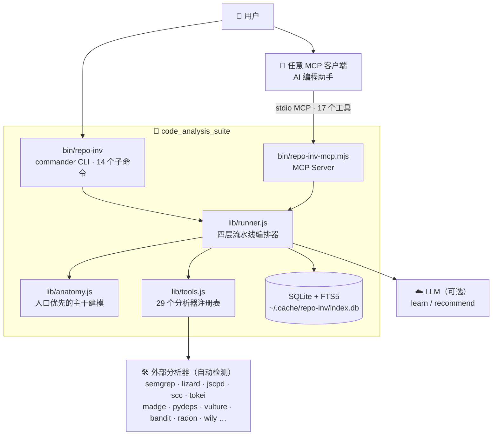

<a id="top"></a>

<div align="center">

# 🔬 Code Analysis Suite

**Static Analysis Toolbox for AI Agents**

**一条命令驱动 29 个静态分析器，为任意仓库产出解剖 / 架构 / 逻辑 / 效率四层证据，并沉淀为可跨仓检索、对比与反向审查的 SQLite 知识库 —— 目标仓库全程只读。**


</div>

---

## 📖 目录

- [项目简介](#-项目简介)
- [系统架构](#-系统架构)
- [核心特性](#-核心特性)
- [技术栈](#️-技术栈)
- [快速开始](#-快速开始)
- [常用命令](#-常用命令)
- [项目结构](#-项目结构)
- [测试](#-测试)
- [开发路线图](#️-开发路线图)
- [文档索引](#-文档索引)
- [许可证](#-许可证)

---

## 🌟 项目简介

让 AI Agent 看懂一个陌生代码库，靠逐行读源码既慢又贵。Code Analysis Suite 换了一条路：**能调工具就不读源码**。它把 29 个业界成熟的静态分析器（semgrep、lizard、jscpd、scc、madge、radon……）编排进统一的 `repo-inv` CLI，一次 `analyze` 即可并行产出四层证据：

| 层 | 回答的问题 |
|---|---|
| **解剖（Anatomy）** | 主干是什么？入口、可部署单元、对外接口、业务流程骨架 |
| **架构（Architecture）** | 有哪些模块？如何连接？循环依赖在哪里？ |
| **逻辑（Logic）** | 复杂度、重复代码、死代码、安全风险集中在哪？ |
| **效率（Efficiency）** | 复杂度随时间如何演化？热点在哪？ |

每次分析自动写入本地 SQLite + FTS5 知识库。分析过几个仓库之后，`search` / `compare` / `borrow` 就能回答「这个问题有人解决过吗、谁的解法更好」，也可以拿优秀仓库当标尺**反向审查自己的项目**。

> 🔒 **只读承诺**：所有产出写入 `~/.cache/repo-inv/`，目标仓库永不被修改。未安装的分析器自动跳过（`repo-inv tools` 查看可用性），不会因此中断。

---

## 🏗 系统架构



设计原则：CLI 与 MCP 两个接口共享同一份 `lib/runner.js` 实现；`report.json` 是面向机器的主产物，`SUMMARY.md` 是面向人的视图，两者来自同一个聚合器。

---

## ⚡ 核心特性

| 特性 | 说明 |
|---|---|
| 🔬 一键四层剖析 | `repo-inv analyze <path> --parallel` 并行跑完解剖 / 架构 / 逻辑 / 效率四层，产出 `SUMMARY.md` + 机器可读的 `report.json`（schema `repo-inv/report@1`） |
| 🧰 29 个分析器统一封装 | 覆盖 LOC 统计、依赖图、圈复杂度、重复率、死代码、SAST、类型检查、性能画像；缺装自动跳过，`repo-inv tool <name>` 给出安装提示 |
| 🧠 跨仓知识库 | 每次分析索引进 SQLite + FTS5；`search` 支持 `OR` / `"短语"` / `-排除` / `前缀*` 全文检索，`compare` 并排对比两个仓库的质量指标 |
| 🧩 架构模式识别 | `repo-inv patterns <repo>` 用内置的 20 条 Semgrep 规则识别重试、依赖注入、插件加载等模式，支持跨仓反查 |
| 📋 以标杆仓库反向审查 | `repo-inv review` / `audit --against <优秀仓库>` 拿主干模型当标尺审视自己的项目 |
| 🔌 双接口：CLI + MCP | 内置 stdio MCP Server（17 个工具），一条 `repo-inv install-mcp` 注册到各类 MCP 客户端，Agent 无需 shell 即可调用全部能力 |

---

## 🛠️ 技术栈

| 层次 | 技术选型 | 说明 |
|---|---|---|
| 运行时 | Node.js 18+ | CLI 与 MCP Server 均为纯 JavaScript（`bin/` + `lib/`） |
| CLI 框架 | commander 14 | 14 个子命令，彩色输出由 chalk 4 / ora 9 提供 |
| MCP 集成 | @modelcontextprotocol/sdk 1.x | stdio 传输，17 个工具与 CLI 能力一一对应 |
| 知识库 | better-sqlite3 12 + FTS5 | 仓库、语言、热点、模式四张表 + 全文检索虚表 |
| JS/TS 分析 | madge 8 · dependency-cruiser 17 | 依赖图与循环依赖检测（内置依赖） |
| 外部分析器 | semgrep · lizard · jscpd · scc · tokei · radon · wily · pyright · bandit … | 运行时自动检测，缺失即跳过 |
| LLM（可选） | DeepSeek API | `learn` / `recommend` 子命令，通过 `.env` 配置 |

---

## 🚀 快速开始

**前置要求**：Node.js 18+、npm。

```bash
git clone https://github.com/CHINGBOH/code-analysis-suite.git
cd code-analysis-suite && npm install && sudo npm link

repo-inv analyze /path/to/repo --parallel   # 分析任意仓库
repo-inv search "retry OR backoff"          # 分析过几个仓库后跨仓检索
```

注册 MCP Server 到你的 Agent 客户端（幂等，写入前自动备份原配置）：

```bash
repo-inv install-mcp          # 列出支持的主机及注册状态
repo-inv install-mcp <host>   # 注册到指定主机，详见 docs/MCP.md
```

查看当前环境里哪些分析器可用：

```bash
repo-inv tools
```

---

## 📟 常用命令

| 要回答的问题 | 命令 |
|---|---|
| 架构 — 入口、部署单元、依赖图 | `repo-inv dissect <repo>` · `analyze <repo> -l anatomy,arch` |
| 函数质量 — 复杂度、重复、死代码 | `repo-inv analyze <repo> -l logic` |
| 模块边界 — 循环依赖、分层违规 | `repo-inv patterns <repo>` |
| 效率 — 热点、演化、内存 | `repo-inv analyze <repo> -l efficiency` |
| 跨仓先例 — 「有人解决过吗」 | `repo-inv search "<q>"` · `borrow "<topic>"` · `compare <a> <b>` |
| 反向审查自己的项目 | `repo-inv review <repo>` · `audit <repo> --against <优秀仓库>` |

完整命令清单与示例见 [docs/USAGE.md](docs/USAGE.md)。

---

## 📁 项目结构

```text
code-analysis-suite/
├── bin/
│   ├── repo-inv            # CLI 入口（commander，14 个子命令）
│   └── repo-inv-mcp.mjs    # stdio MCP Server（17 个工具）
├── lib/
│   ├── runner.js           # 四层流水线编排 + SUMMARY/report 聚合
│   ├── tools.js            # 29 个分析器的静态注册表
│   ├── anatomy.js          # 入口优先的主干建模与标杆画像
│   ├── standard.js         # 通用 / Agent / RAG / CRM 评测标准
│   ├── insights.js         # 跨仓洞察与推荐
│   ├── db.js               # SQLite + FTS5 封装（upsertReport、search…）
│   └── env.js              # .env 加载（密钥不入库）
├── rules/                  # 内置 Semgrep 规则（重试、DI、插件等 20 条模式）
├── docs/                   # 架构、用法、MCP 集成文档与深度分析报告
└── linux/ bash/ snapd/ cli/ cc-haha/ finance-repos/ oss-graph-repos/
                            # ⚠️ 已分析项目的源码快照（语料），非套件代码
```

---

## 🧪 测试

当前仓库尚未包含自动化测试套件（`npm test` 为占位脚本）。验证方式以 CLI 自检与端到端分析为主：

```bash
repo-inv tools                 # 检查 29 个分析器的安装状态
repo-inv analyze . --parallel  # 对本仓库跑一次完整分析，核对 SUMMARY.md / report.json
```

自动化测试与 CI 已列入下方路线图。

---

## 🗺️ 开发路线图

- [x] 四层剖析流水线（解剖 / 架构 / 逻辑 / 效率）与并行调度
- [x] SQLite + FTS5 跨仓知识库（`search` / `compare` / `list`）
- [x] 基于 Semgrep 的 20 条架构模式识别与跨仓反查
- [x] stdio MCP Server（17 个工具）与一键 `install-mcp` 注册
- [x] 可选 LLM 能力（`learn` / `recommend`）
- [ ] 自动化测试套件与 CI 流水线
- [ ] 发布到 npm registry（免去 `npm link`）
- [ ] 更多语言的效率层分析（Go / Rust 画像工具接入）
- [ ] 分析报告的可视化导出（HTML / SVG 汇总页）

---

## 📚 文档索引

| 文档 | 内容 |
|---|---|
| [docs/ARCHITECTURE.md](docs/ARCHITECTURE.md) | 系统架构、分析流水线时序、知识库表结构 |
| [docs/USAGE.md](docs/USAGE.md) | 全部子命令的端到端用法与输出示例 |
| [docs/MCP.md](docs/MCP.md) | MCP Server 注册、17 个工具清单、故障排查 |
| [docs/AI_DEV_STANDARD.md](docs/AI_DEV_STANDARD.md) | 内置的评测标尺：`audit` / `review` 对照的开发标准 |
| [docs/zh/README.md](docs/zh/README.md) | 中文文档 |
| [CONTRIBUTING.md](CONTRIBUTING.md) | 贡献指南 |

`docs/` 下还收录了用本套件完成的真实深度分析样例，如 [Linux 内核](docs/linux_kernel_deep_dive.md)、[CPython](docs/python_cpython_investigation_report.md)、[Ubuntu 生态](docs/ubuntu_ecosystem_deep_dive.md)、[软件供应链安全](docs/software_supply_chain_security_report.md) 等。

---

## 📄 许可证

本项目基于 [MIT License](LICENSE) 开源。

---

<div align="center">

**[⬆ 回到顶部](#top)**

</div>
