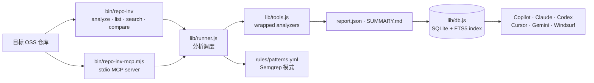

<div align="center">

# 🔬 Code Analysis Suite

**面向 AI Coding Agent 的开源仓库静态分析与跨仓知识库工具箱**
_An agent-facing static analysis suite and cross-repo knowledge base for OSS codebases_

<p>


</p>

<p>


</p>

</div>

---

## 📖 简介 · About

Code Analysis Suite 为 AI Coding Agent 提供一个确定性的仓库调查入口：`repo-inv analyze <path>` 会调度静态分析器、汇总报告，并把结果写入本地 SQLite + FTS5 知识库，避免 Agent 在大型陌生代码库中盲目 grep 或臆造架构。

它同时提供 CLI 与 MCP stdio server 两种接口，面向 Copilot、Claude Code、Codex、Cursor、Gemini、Windsurf 等 Agent 主机复用同一套 12 个子命令 / 9 个 MCP 工具。详细设计见 [`docs/ARCHITECTURE.md`](docs/ARCHITECTURE.md)，用法见 [`docs/USAGE.md`](docs/USAGE.md) 与 [`docs/MCP.md`](docs/MCP.md)。

## ✨ 特性 · Features

- 🧭 **一条命令分析仓库** — `repo-inv analyze /path/to/repo --parallel` 生成机器报告与摘要
- 🧠 **跨仓知识库** — 分析结果索引到 `~/.cache/repo-inv/index.db`，支持 list/search/compare/recommend
- 🔌 **MCP 集成** — `repo-inv-mcp` 为多类 Agent 主机暴露 stdio 工具
- 🏗️ **三层分析管道** — 架构、业务逻辑、效率/演化三类静态分析汇总
- �� **规则与模式库** — `rules/patterns.yml` 保存 Semgrep 模式与可复用经验
- 📚 **双语文档** — `docs/` 含架构、用例、MCP 与中文说明

## 🏗️ 架构 · Architecture



## 🚀 快速开始 · Quick Start

### 环境要求 · Prerequisites

- Node.js 18+
- npm
- 可选：Python / Go / Rust / Java 等语言工具链；缺失的静态分析器会自动跳过

### 安装 · Installation

```bash
# 1. 克隆并进入项目
git clone https://github.com/CHINGBOH/code-analysis-suite.git
cd code-analysis-suite

# 2. 安装 Node 依赖
npm install

# 3. 暴露 CLI / MCP 命令
sudo npm link

# 4. 查看可用分析器
repo-inv tools

# 5. 分析任意已克隆仓库
repo-inv analyze /path/to/some-cloned-oss-repo --parallel
```

## 📂 目录结构 · Project Structure

```text
code-analysis-suite/
├── .agents/          # Skill / Agent 侧说明
├── .github/          # GitHub 工作流与项目配置
├── bin/              # repo-inv CLI 与 repo-inv-mcp 入口
├── docs/             # 架构、用法、MCP、中文文档
├── lib/              # runner、tools、db、env 核心实现
├── rules/            # Semgrep / 模式规则
├── AGENTS.md         # 通用 Agent Contract
├── CONTRIBUTING.md   # 贡献说明
├── LICENSE           # MIT License
├── package.json      # Node 包与 bin 映射
└── README.md         # 项目门面入口
```

## 🛠️ 技术栈 · Built With


## 📄 License

[MIT](LICENSE) — © 2026 code_analysis_suite contributors.

---

<div align="center"><sub>📐 README 遵循 <a href="https://github.com/othneildrew/Best-README-Template">Best-README-Template</a> 标准</sub></div>
