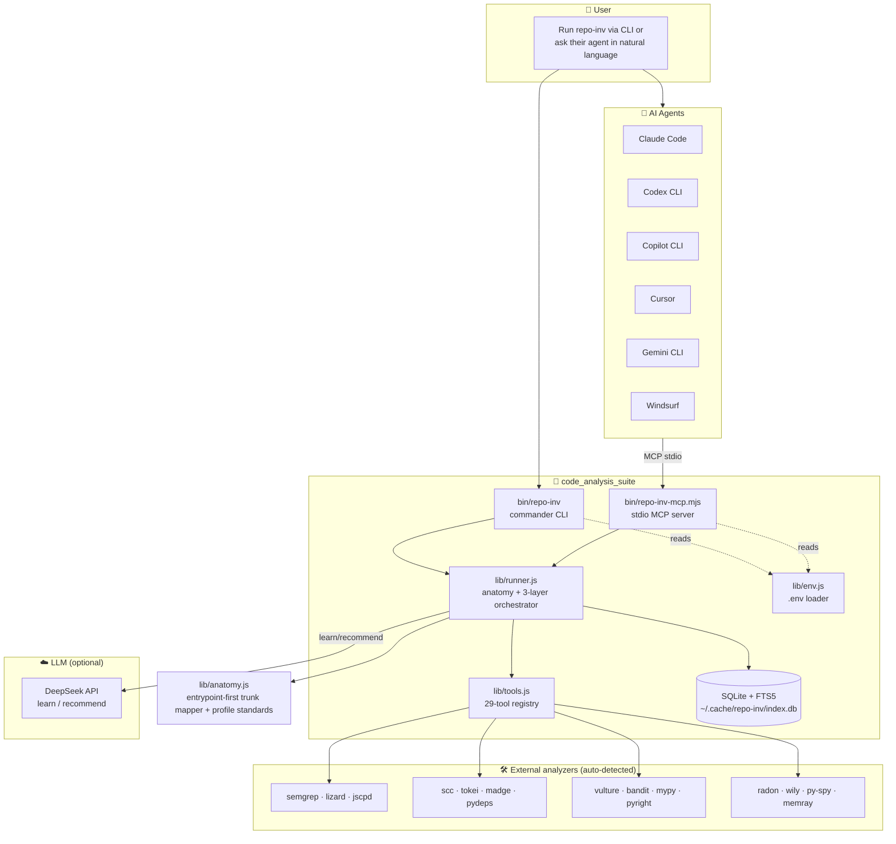
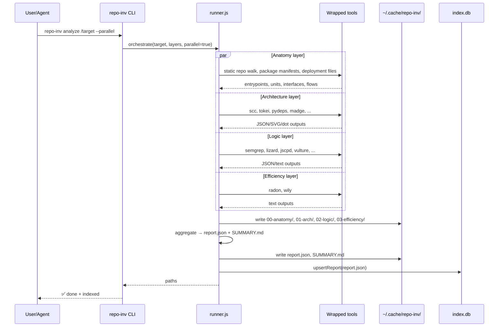
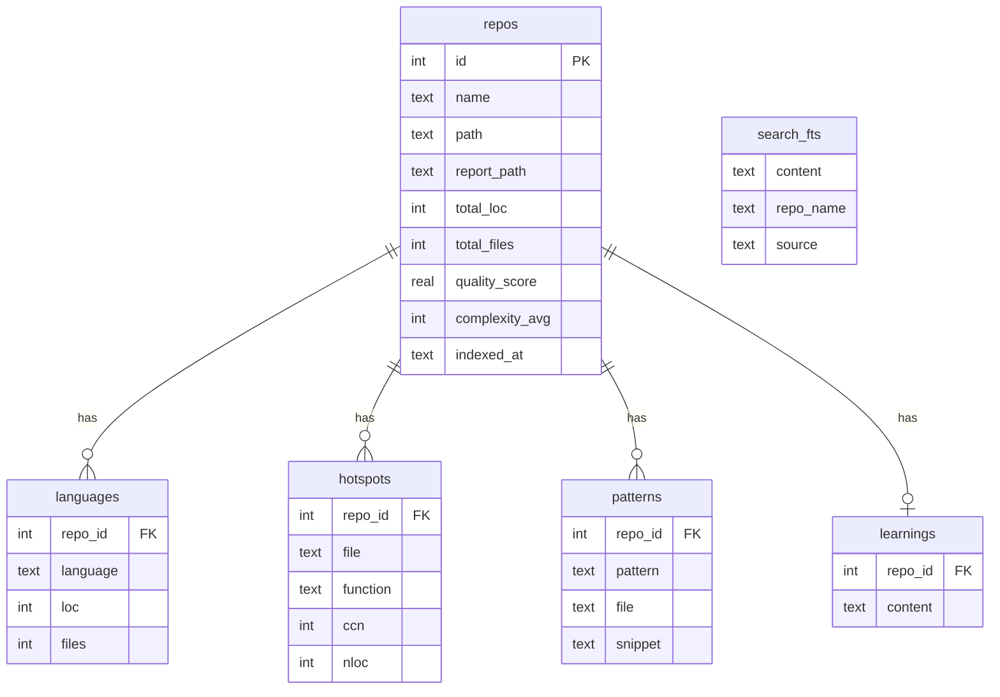

# Architecture

> How `code_analysis_suite` maps source code around the main trunk: deployable units, entrypoints, exposed interfaces, business-flow skeletons, and reusable assets.

## High-level



## The `analyze` pipeline



## Three layers, three questions

| Layer | Dir | Question | Primary outputs |
|---|---|---|---|
| **Standards** | built-in | *Which benchmark profile applies? generic, pure-agent, RAG-agent, CRM-agent* | `STANDARD_ARCHITECTURE.md`, `STANDARD_EVALUATION.md` |
| **Anatomy** | `00-anatomy/` | *What is the main trunk? Which deployable units and entrypoints exist?* | `anatomy.json`, `ANATOMY.md`, `BUSINESS_FLOWS.md`, `BORROWABLES.md` |
| **Architecture** | `01-arch/` | *What modules exist? How do they connect?* | `scc.json`, `tokei.json`, `pydeps.svg`, `madge-circular.txt`, `code2flow.gv`, `git-contributors.txt` |
| **Logic** | `02-logic/` | *Where's the complexity, duplication, risk?* | `semgrep.json`, `lizard.txt`, `jscpd/`, `vulture.txt`, `bandit.json`, `pyright.json` |
| **Efficiency** | `03-efficiency/` | *How does complexity evolve over time?* | `radon-cc.txt`, `radon-mi.txt`, `wily.txt`, optional `py-spy.svg`, `memray.html` |

The aggregator splices the first 2000 chars of each key file into `SUMMARY.md` (human view)
and structures the same data into `report.json` (machine view, schema = `repo-inv/report@1`).

## Knowledge base schema



`search_fts` is a FTS5 virtual table indexing `SUMMARY.md` + `LEARNINGS.md` of every
analyzed repo. Powers `repo-inv search` and `MCP search_knowledge`.

## Source map

```
code_analysis_suite/
├── bin/
│   ├── repo-inv              # commander CLI, 12 subcommands, install-mcp logic
│   └── repo-inv-mcp.mjs      # stdio MCP server, 17 tools
├── lib/
│   ├── runner.js             # 3-layer orchestrator + SUMMARY/report builders
│   ├── tools.js              # static registry of all 29 wrapped tools
│   ├── env.js                # .env loader (gitignored secrets)
│   ├── db.js                 # SQLite + FTS5 wrappers (upsertReport, search, ...)
│   ├── patterns.js           # semgrep-driven architectural pattern detection
│   ├── extract.js            # 1-hop import-aware code transplant
│   └── llm.js                # DeepSeek client for learn/recommend
├── rules/
│   └── patterns.yml          # 20 curated semgrep rules (retry, DI, plugin, ...)
├── .agents/skills/repo-investigator/
│   ├── SKILL.md              # skill descriptor for skill-aware agents
│   └── scripts/analyze.sh    # thin bash wrapper around the Node CLI
├── docs/                     # YOU ARE HERE
├── AGENTS.md                 # vendor-neutral agent contract
└── README.md                 # public face
```

## Design principles

1. **Skip-if-missing, never abort.** Any wrapped tool that isn't installed is silently
   skipped. `repo-inv tools` is the single place to check availability.
2. **The target repo is read-only.** All output goes under `~/.cache/repo-inv/`.
3. **Two interfaces, one truth.** CLI and MCP both call into `lib/runner.js`. No
   capability is CLI-only or MCP-only.
4. **Machine-readable first.** `report.json` is the agent's primary input; `SUMMARY.md`
   is the human's. Both come from the same aggregator.
5. **Persistent memory.** Every analysis is indexed. The cross-repo `search` /
   `compare` / `recommend` commands are what make this more than a wrapper.
6. **Vendor-neutral.** Configuration paths are runtime-resolved (`__dirname` after
   `npm link`). No `/home/l/...` strings anywhere in source or docs.
